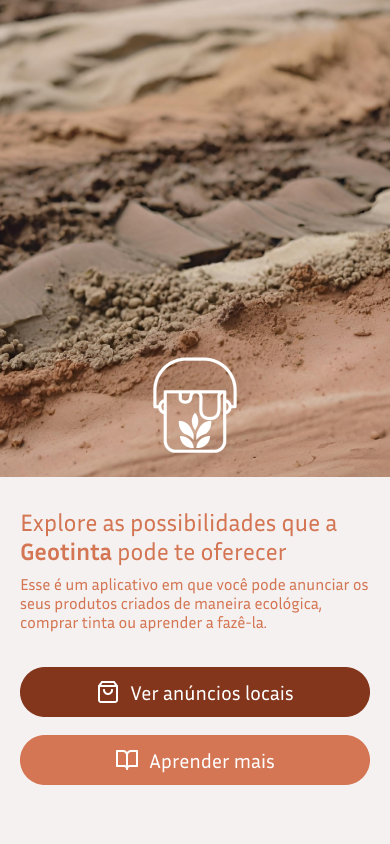
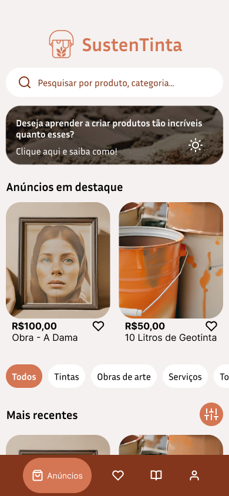
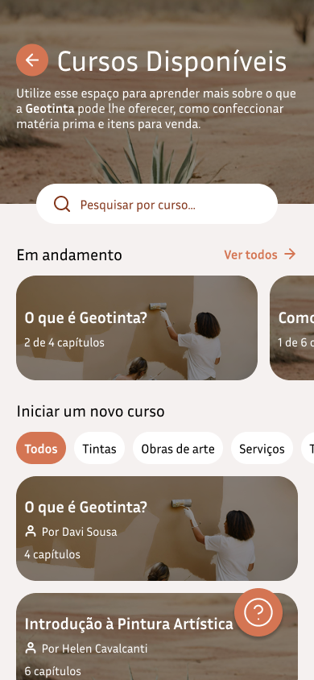

  
  <h1>SustenTinta</h1>

---

## 📖 About

Sustentinta APP has two main big features:

#### Marketplace

- Users can create post and sell their products
- Users favorite products from other users

#### Courses

- Users can see the available courses
- Users can enroll in courses

## 🛠 Pre-requisites

- [Node.js](https://nodejs.org/en/)
- (Optionally) [Android Studio](https://developer.android.com/studio)

## 🚀 How to run

- Clone the repository
- Install the dependencies with `npm i`
- Run the project with `npm start`
- Connect your device or emulator
  - You can use [Expo GO app](https://expo.io/client) to run the app on your device

## Prototype (Figma)

- [SustenTinta](https://www.figma.com/file/cjkTmiEUa069NheF0v9xir/Sustentinta?type=design&node-id=0%3A1&mode=design&t=OiPyFuZyNS0t3z5k-1)

#### Screenshots

  
  
  

